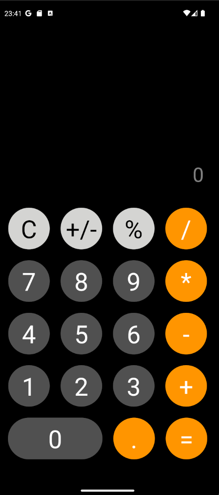

# IOS Calculator Mobile - React Native



## Descripción

Este proyecto es un clon de la calculadora de iOS desarrollada en React Native con el Framework Expo. La aplicación emula el comportamiento y diseño de la calculadora nativa de iOS, ofreciendo las operaciones aritméticas básicas, manejo de porcentajes, y funcionalidad de cambio de signo.

## Características

- **Operaciones Básicas**: Suma, resta, multiplicación y división.
- **Porcentajes**: Calcula el porcentaje de un número.
- **Cambio de Signo**: Cambia el signo de un número positivo a negativo y viceversa.
- **Soporte de Decimales**: Permite la entrada de números decimales y asegura que solo se pueda ingresar un punto decimal por número.
- **Limpieza de Entrada**: Permite limpiar la entrada y el resultado actual con el botón "C".
- **Manejo de Errores**: Muestra "Error" cuando se realiza una operación inválida.

## Instalación

### Prerrequisitos

- **Node.js** y **npm**.
- **Expo CLI Client** (si estás usando Expo).

### Pasos de Instalación

1. **Clona el Repositorio**:
   ```bash
   git clone https://github.com/susinodevelop/ios-calculator-mobile.git
   cd ios-calculator-mobile
